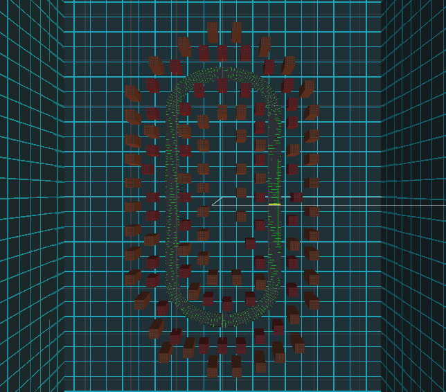

# Arcade Racer 2049

## Description du projet

Ce projet de jeu 3D est fait dans le cadre du cours [INF5071 - Infographie](https://etudier.uqam.ca/cours?sigle=INF5071) du Bacclauréat en informatique et génie logiciel de l'UQAM.
 
Ce jeu est fait à l'aide du moteur de jeu [Unity 3D](https://unity3d.com/fr) en langage C#. Pour la création des modèles et animations simples [Blender](https://www.blender.org/) a été utilisé. Les textures ont été faites à l'aide de [Gimp](https://www.gimp.org/).

## Concept

Ce jeu de course se déroule dans un environnement urbain futuriste inspiré de l'esthétique du film [Tron](https://fr.wikipedia.org/wiki/Tron) cependant sans utiliser les concepts de course du film de 1982. L'objectif est pour le pilote d'un engin de type aéroglisseur de terminer 3 tours de piste en 120 secondes et d'éviter les obstacles sur la piste. Cette idée de jeu est principalement inspirée du jeu [F-Zero](https://en.wikipedia.org/wiki/F-Zero) sur la SNES et du jeu [Wipeout](https://en.wikipedia.org/wiki/Wipeout_(video_game)) sur Playstation, en ce qui concerne le tempo du jeu et son décor cependant sans retenir le concept d'adversaires contrôlés par un I.A.

Il y a des obstacles en forme de X sur la piste qui bougent à des vitesses variables. Si le véhicule de course entre en collision avec un ennemi il y a perte de temps de 5 secondes et d'énergie allant de 10 à 15 points. Il y a aussi des engins se déplaçant sur la piste qui agissent comme borne de recharge. Si le véhicule en touche une, il y a ajout de 10 points d'énergie. 

## Contenu du dépôt

Le dossier `arcade-racer-2049` est le dossier de projet Unity. Certains fichier non-essentiels sont ignoré, pour plus de détail voir le fichier `.gitignore`. Le dossier `textures` contient les textures et développements UV des modèles du jeux. Le dossier `models` contient les fichiers Blender de tous les modèles du jeux.

## Contrôles du jeux

Pour naviguer le menu de départ et le menu de fin de jeux, il faut utiliser les touches `haut` et `bas`. Pour sélectionner un élément du menu, il faut peser sur la touche `entrée`. Durant la course, pour accélérer la touche `haut` est utilisée et pour décélérer la touche `bas` est utilisée. Pour tourner le véhicule, il faut peser sur la flèche `gauche` ou `droite`. À tout moment durant la course vous pouvez quitter le jeux en pesant sur la touche `Échap`.

## Images

**Le véhicule de course**

**La piste de course**

**Le modèle de l'obstacle**

**Le modèle de la borne de recharge**

**La ville vue de haut**

## Ressources audio

_Toutes les ressources audio sont sous licence Creative Commons._

### Musique

- ["Battle!" par Visager](http://freemusicarchive.org/music/Visager/Songs_From_An_Unmade_World_2/Visager_-_Songs_From_An_Unmade_World_2_-_22_Battle_-Loop-) (musique du niveau de jeu)
- ["I'm a Fighter" par Ozzed](https://ozzed.net/music/8-bit-run-and-pun.shtml#listen) (musique du menu d'introduction)
- ["Just a minuet" par Ozzed](https://ozzed.net/music/8-bit-run-and-pun.shtml#listen) (musique du menu de fin de partie)

### Effets sonores

- ["8-bit Powerup1"](https://freesound.org/people/timgormly/sounds/170155/) (son quand on touche une borne de rechargement)
- ["Aluminium Loud Hit"](https://freesound.org/people/sacha-rush/sounds/455334/) (son de collision avec un mur)
- ["Error"](https://freesound.org/people/Autistic%20Lucario/sounds/142608/) (son de collision avec un obstacle)
- ["Spacey 1up"](https://freesound.org/people/GameAudio/sounds/220173/) (son de tour de piste complété)
- ["Start race bleeps"](https://freesound.org/people/Timbre/sounds/98007/) (son de début de course)

## Tutoriels utilisés

- ["Adding Music to Your Game"](https://unity3d.com/learn/tutorials/topics/audio/adding-music-your-game) (tutoriel Unity)
- ["Blender Tutorial: Making a Racing Track for a Car Game"](https://www.youtube.com/watch?v=SDLLbKvEeBY) (tutoriel youtube)
- ["Checkpoint and Lap System in Unity Engine"](https://www.youtube.com/watch?v=7NehsLWcFIU) (tutoriel youtube)
- ["Creating a Hover Car with Physics"](https://unity3d.com/fr/learn/tutorials/modules/beginner/live-training-archive/hover-car-physics) (tutoriel Unity)
- ["How to Bake Perfect Normals in Blender"](https://www.youtube.com/watch?v=0r-cGjVKvGw) (tutoriel youtube)
- ["How to Make a Main Menu in Unity"](https://www.instructables.com/id/How-to-make-a-main-menu-in-Unity/) (tutoriel web)
- ["Importing Blender model with textures - Unity 5"](https://answers.unity.com/questions/983465/importing-blender-model-with-textures-unity-5.html) (tutoriel web)
- ["Sound Effects & Scripting"](https://unity3d.com/fr/learn/tutorials/topics/audio/sound-effects-scripting) (tutoriel Unity)
- ["Unity 5: How to Make Objects Follow a Path"](https://www.youtube.com/watch?v=fKWTpi70a_E) (tutoriel youtube)

## Licence

Ce jeux est sous la licence [GPLv3](https://www.gnu.org/licenses/quick-guide-gplv3.fr.html).
